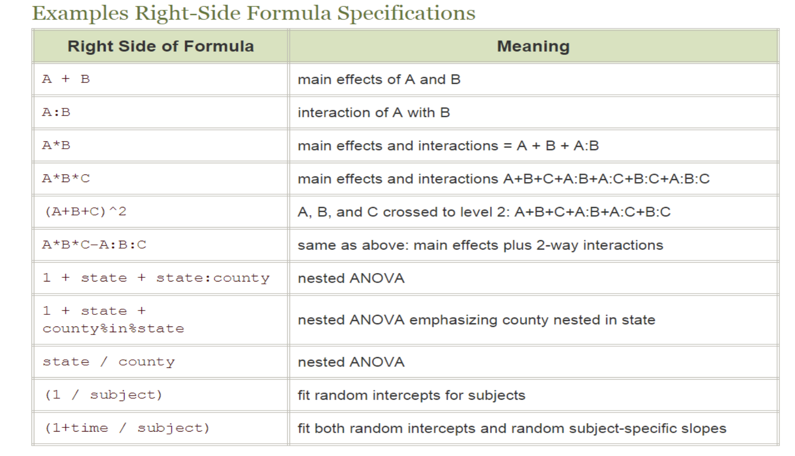

```{r setup, include=FALSE}
knitr::opts_chunk$set(echo = TRUE)
```

```{r}
library(tidyverse)
library(Hmisc)
library(MASS)
library(PerformanceAnalytics)
library(gvlma)
```

Обновление

```{r}
# install.packages("Hmisc")
# library(installr)
# updateR()
```


# Этап 1

## Общая информация о курсе

Тут всё понятно. Двигаем дальше

## Переменные

Ознакомительные этапы. Всё просто. Ответ на задачу:


```{r}
# my_vector_2 <- my_vector[my_vector > (mean(my_vector) - sd(my_vector)) & my_vector < (mean(my_vector) + sd(my_vector))]
```

## Работа с data frame

### Задача

Ваша задача создать новый `dataframe` под названием `mini_mtcars`, в котором будут сохранены только третья, седьмая, десятая, двенадцатая и последняя строчка датафрейма `mtcars`.

```{r}
mini_mtcars <- mtcars[c(3, 7, 10, 12, length(mtcars$mpg)), ]
```

### Задача

В этой задче поработаем со встроенными данными mtcars. В датафрэйме mtcars создайте новую колонку (переменную) под названием even_gear, в которой будут единицы, если значение переменной (gear) четное, и нули если количество нечетное. 

```{r}
mtcars$even_gear <- as.numeric(mtcars$gear %% 2 == 0)
```

### Задача

Продолжим нашу работу с данными mtcars. Теперь ваша задача создать переменную - вектор mpg_4 и сохранить в нее значения расхода топлива (mpg) для машин с четырьмя цилиндрами (cyl). 

```{r}
mpg_4 <- mtcars$mpg[mtcars$cyl == 4]

factorial(43) / (factorial(8) * factorial(43-8))
factorial(43) / (factorial(6) * factorial(43-6))

```


## Элементы синтаксиса

Введём тестовый набор данных

```{r}
mydata <- read.csv("evals.csv")
```


```{r}
mydata$quality <- rep(NA, nrow(mydata))
```


```{r}
for (i in 1:nrow(mydata)){
  if (mydata$score[i] > 4){
    mydata$quality[i] <- "good"
  } else mydata$quality[i] <- "bad"
}
```

### Задача

Создайте новую числовую переменную  `new_var` в данных `mtcars`, которая содержит единицы в строчках, если в машине не меньше четырёх карбюраторов (переменная "carb") или больше шести цилиндров (переменная "cyl"). В строчках, в которых условие не выполняется, должны стоять нули.

```{r}
for (i in 1:nrow(mtcars)) {
  if (mtcars$carb[i] >= 4 || mtcars$cyl[i] > 6){
    mtcars$new_var[i] <- 1
  } else mtcars$new_var[i] <- 0
}
```

### Задача

```{r}
my_vector <- 1:50
```


Если среднее значение вектора `my_vector` больше 20, в переменную `result` сохраните "My mean is great",  если среднее значение `my_vector` меньше или равно 20 то в переменную `result` сохраните  строку "My mean is not so great".

```{r}
if(mean(my_vector) > 20){
result <- "My mean is great"
} else {
  result <- "My mean is not so great"
}
```

### Задача

В встроенных в R данных AirPassengers хранится 144 значения (количество пассажиров в месяц) с 1949 по 1960 год. Данные Time-Series очень похожи на вектор по своей структуре, например мы можем обратиться к любому из 144 элементов используя уже знакомую нам индексацию AirPassengers[1] или AirPassengers[56].

Можно вообще перевести исходные данные в вектор при помощи команды as.vector(AirPassengers) и продолжить с ними работу как с вектором.

И так ваша задача создать переменную good_months и сохранить в нее число пассажиров только в тех месяцах, в которых это число больше, чем показатель в предыдущем месяце.  

Важный момент! В R оператор : для создания последовательности имеет приоритет над арифметическими действиями. Таким образом, если у вас есть переменная i, равная 10, и вы хотите создать вектор от 1 до i - 1, воспользуйтесь скобками, чтобы указать последовательность действий.

```{r}
?AirPassengers # справка о данных
str(AirPassengers) # структура данных
```

```{r}
(fit <- arima(log10(AirPassengers), c(0, 1, 1),
              seasonal = list(order = c(0, 1, 1), period = 12)))
update(fit, method = "CSS")
update(fit, x = window(log10(AirPassengers), start = 1954))
pred <- predict(fit, n.ahead = 24)
tl <- pred$pred - 1.96 * pred$se
tu <- pred$pred + 1.96 * pred$se
ts.plot(AirPassengers, 10^tl, 10^tu, log = "y", lty = c(1, 2, 2))
```

Моё решение:

```{r}
length(AirPassengers) 

AirPassengers[1] < AirPassengers[145]

good_months<-c()
for (i in 1:(length(AirPassengers)-1)) {
  if (AirPassengers[i+1]>AirPassengers[i]) {
    good_months<-append(good_months,AirPassengers[i+1]) 
  }
}
```

Более ровное решение с циклом

```{r}
good_months <- c()    
index <- 1    
for (i in 2:length(AirPassengers)) {    
	if (AirPassengers[i]>AirPassengers[i-1]){    
		good_months[index] <- AirPassengers[i]    
		index <- index + 1    
		}    
	}
```

Очень красивое решение, без цикла

```{r}
good_months <- AirPassengers[-1][AirPassengers[-1] > AirPassengers[-144]]
```

Разберём его. 
Делаем два вектора. 
Первый `AirPassengers[-1]` --- вектор без первого значения
Второй `AirPassengers[-144]` --- вектор без последнего значения
Далее мы сравниваем значение с его последующим значением.

При сравнении, мы получаем логический вектор

```{r}
AirPassengers[-1] > AirPassengers[-144]
```

Далее, чтобы получить обратно значения, нужно в исходном векторе без первого значения взять `TRUE` индексы

### Задача

Для встроенных в R данных AirPassengers рассчитайте скользящее среднее с интервалом сглаживания равным 10. Напечатайте получившийся результат (первым значением в выводе должно быть среднее для элементов 1:10, во втором значении - среднее для элементов 2:11 и т.д., в последнем  - среднее для элементов 135 :144)

Все полученные значения средних сохраните в переменную moving_average.


Моё решение:
```{r}
x <- c(2, 4, 7)
y <- c(2, 3, 5)
x - y
cumsum(x)
cumsum(1:10)
as.vector(AirPassengers)

moving_average <- (cumsum(AirPassengers)[10:144] - c(0, cumsum(AirPassengers[1:134]))) / 10
```


В общем виде:

```{r}
n <- 10    
d <- AirPassengers    
cx <- c(0, cumsum(d))    
moving_average <- (cx[(n + 1):length(cx)] - cx[1:(length(cx) - n)]) / n
```

Можно через цикл:

```{r}
moving_average <- numeric(135) # создаем пустой числовой вектор из 135 элементов    
last_index <- length(AirPassengers) - 9    
for (i in 1:last_index) {    
	end <- i + 9    
	moving_average[i] <- mean(AirPassengers[i:end])    
}
```


## Описательные статистики

`aggregate()` --- позволяет разбивать на группы.

```{r}
mean_hp_vs <- aggregate(x = mtcars$hp, by = list(mtcars$vs), FUN = mean)
colnames(mean_hp_vs) <- c("VS", "Mean HP")
mean_hp_vs
```

Короткая запись выглядит вот так

```{r}
aggregate(hp ~ vs, mtcars, mean)
```

Разбиение по двум переменным

```{r}
aggregate(hp ~ vs + am, mtcars, mean)
```

Есть библиотека `psych` в которой есть джентельменский набор большинства описательных статистик

```{r}
# install.packages("psych")
library(psych)
```

Итак опистельные статистики в одном флаконе

```{r}
descr <- describe(x = mtcars[, -c(8,9)])
```

Более новая версия `describeBy`

```{r}
descr2 <- describeBy(x = mtcars[, -c(8,9)], group = mtcars$vs) # В выводе лист

descr2 <- describeBy(x = mtcars[, -c(8,9)], group = mtcars$vs, mat = TRUE, digits = 1) # В выводе матрица, с одни знаком после запятой
```

Можно сократить вывод до кол-ва базовых статистик

```{r}
descr3 <- describeBy(x = mtcars[, -c(8,9)], group = mtcars$vs, mat = TRUE, digits = 1, fast = TRUE)
```


### Задача

Вновь вернемся к данным `mtcars`. Рассчитайте среднее значение времени разгона `qsec` для автомобилей, число цилиндров `cyl` у которых не равняется 3 и показатель количества миль на галлон топлива `mpg` больше 20.

Получившийся результат (среднее значение) сохраните в переменную `result`.

```{r}
result <- mean(mtcars$qsec[mtcars$cyl != 3 & mtcars$mpg > 20])
```

### Задача

При помощи функции aggregate рассчитайте стандартное отклонение переменной hp (лошадиные силы) и переменной disp (вместимости двигателя)  у машин с автоматической и ручной коробкой передач. 

Полученные результаты (результаты выполнения функции aggregate) сохраните в переменную descriptions_stat.

```{r}
descriptions_stat <- aggregate(x = mtcars[, c("hp", "disp")], by = list(mtcars$am), FUN = sd)
```

Вот чуть более изящное применение 

```{r}
descriptions_stat <- aggregate(. ~ mtcars$am,mtcars[,c(3,4)],sd)
```

### Задача

Примените функцию describeBy к количественным переменным данных airquality, группируя наблюдения по переменной Month.  Чему равен коэффициент асимметрии (skew) переменной Wind в восьмом месяце?

В графу с ответом требуется ввести только число. Десятичный разделитель - запятая: например 12,6

```{r}
describeBy(x = airquality$Wind, group = airquality$Month)
```


### Задача

Обратимся к встроенным данным iris. Соотнесите значения стандартного отклонения переменных.

```{r}
iris
describeBy(x = iris)
```

### Задача

В данных iris расположите по убыванию значения медиан количественных переменных в группе virginica.

```{r}
describeBy(x = iris, group = iris$Species)
```

### Задача

Воспользуемся встроенными данными airquality. В новую переменную сохраните subset исходных данных, оставив наблюдения только для месяцев 7, 8 и 9.

При помощи функции aggregate рассчитайте количество непропущенных наблюдений по переменной Ozone в 7, 8 и 9 месяце. Для определения количества наблюдений используйте функцию length(). 

Результат выполнения функции aggregate сохраните в переменную result.

```{r}
# Это выражение считает и пропущенные значения тоже
aggregate(x = new_airquality[, "Ozone"], by = list(new_airquality$Month), length)

# Это выражение не считает пропущенные значения
aggregate(Ozone ~ Month, subset(airquality, Month > 6), length)
```

### Задача

В переменной my_vector сохранен вектор с пропущенными значениями. Вам нужно создать новый вектор fixed_vector, в котором все пропущенные значения вектора my_vector будут заменены на среднее значение по имеющимся наблюдениям.

При этом исходный вектор оставьте без изменений!

Напоминаю, переменная my_vector уже создана, сразу начинайте работать с ней. Перед тем, как сдавать решение, вы можете потренироваться на различных примерах. Ниже небольшой код, который может создать случайный вектор (выборка из нормального распределения) с пропущенными значениями.

```{r}
my_vector <- rnorm(30)
my_vector[sample(1:30, 10)] <- NA

replace(my_vector, is.na(my_vector), mean(my_vector, na.rm = TRUE))
```

## Описательные статистики. Графики

Базовые графики

```{r}
hist(mtcars$mpg, breaks = 20, xlab = "MPG")
boxplot(mtcars, mpg ~ am)
plot(mtcars$mpg, mtcars$disp)
```

но лучше строить в пакете `ggplot2`.
Вот допустим гистограммы

```{r}
ggplot(mtcars, aes(x = mpg)) +
  geom_histogram(fill = "white", color = "black", binwidth = 2)
```

Вот допустим плотность

```{r}
ggplot(mtcars, aes(x = mpg, fill = factor(am))) +
  geom_density(alpha = 0.6)
```

Ещё пару графиков

```{r}
ggplot(mtcars, aes(x = factor(am), y = hp, color = factor(vs))) +
  geom_boxplot()
```

### Задача

При помощи функции ggplot() или boxplot() постройте график boxplot, используя встроенные в R данные airquality. По оси x отложите номер месяца, по оси y — значения переменной Ozone.

На графике boxplot отдельными точками отображаются наблюдения, отклоняющиеся от 1 или 3 квартиля больше чем на полтора межквартильных размаха. Сколько таких наблюдений присутствует в сентябре (месяц №9)?

```{r}
ggplot(airquality, aes(factor(Month), Ozone)) +
  geom_boxplot()
```


### Задача

Используем знакомые нам данные mtcars. 

Нужно построить scatterplot с помощью ggplot из ggplot2, по оси x которого будет mpg, по оси y - disp, а цветом отобразить переменную (hp).

Полученный график нужно сохранить в переменную plot1. Таким образом в ответе должен быть скрипт:

```{r}
plot1 <- ggplot(mtcars, aes(mpg, disp, color = hp)) +
  geom_point()
```

### Задача

Немного гистограмм с ирисами

```{r}
ggplot(iris, aes(Sepal.Length, fill = Species)) + geom_histogram()
ggplot(iris, aes(Sepal.Length)) + geom_histogram(aes(fill = Species))
```

### Задача

Студент Ярослав очень любит строить графики в R. Основываясь на данных iris он хочет построить следующий график:

Scatterplot (диаграмма рассеивания), где по оси X будет отложена переменная Sepal.Length,  по оси Y переменная  Sepal.Width. За цвет точек будет отвечать переменная  Species, а за размер точек переменная Petal.Length.


```{r}
ggplot(iris, aes(Sepal.Length, Sepal.Width, color = Species, size = Petal.Length)) +
  geom_point()

ggplot(iris, aes(Sepal.Length, Sepal.Width)) +
  geom_point(aes(color = Species, size = Petal.Length))
```

## Анализ номинативных данных

Данные для работы на этом уроке

```{r}
df <- read_csv("grants.csv")

# сделаем замены на фактор и понятные описания
df$status <- as.factor(df$status)
levels(df$status) <- c("Not funded", "Funded")

df$status <- factor(df$status, labels = c("Not funded", "Funded"))

str(df)

# 1d table
t1 <-  table(df$status)

# 2d table
t2 <- table(df$status, df$field)

prop.table(t2)

# 3d table

t3 <- table(Years = df$years_in_uni, Field = df$field, Status = df$status)

dim(t3)
```

Тесты

```{r}
chisq.test(t2)

fisher.test(t2)
```


### Задача

Ваша задача в переменную red_men сохранить долю рыжеволосых (Red) от общего числа голубоглазых мужчин.

```{r}
HairEyeColor
dimnames(HairEyeColor)

# only man
prop.table(HairEyeColor[ , ,'Male'], 2)['Red', 'Blue']
```

* создаем двумерную таблицу, 2- группировка значений по столбцу `prop.table(HairEyeColor[ , ,'Male'], 2)`

* обращаемся к ее х/у `['Red', 'Blue']`

### Задача

Напишите число зеленоглазых женщин в наборе данных HairEyeColor.

```{r}
as.data.frame(HairEyeColor) %>%
  group_by(Sex, Eye) %>%
  summarise(sum = sum(Freq)) %>%
  filter(Sex == "Female", Eye == "Green")
```


### Задача

Какой запрос будет возвращать 1,2 и 5 столбец данных

```{r}
df <- tibble(
  first_name = 1,
  last_name = 2,
  email_address = 3,
  postal_address = 4,
  date_added = 5
)

df

select(df, -(3:4))

df %>% select(c(1:2, 5))
select(df, matches("_.{4,5}$"))
select(df, contains("name"), date_added)
select(df, first_name, last_name, date_added)
```


### Задача

Постройте столбчатую диаграмму распределения цвета глаз по цвету волос только у женщин из 
таблицы HairEyeColor. По оси X должен идти цвет волос, цвет столбиков должен отражать цвет глаз. По оси Y - количество наблюдений.

```{r}
mydata <- as.data.frame(HairEyeColor)

ggplot(data = subset(mydata, Sex == 'Female'), aes(x = Hair , y = Freq, fill = Eye)) + 
  geom_bar(stat="identity", position = "dodge")
```

### Задача

На основе таблицы HairEyeColor создайте ещё одну таблицу, в которой хранится информация о распределении цвета глаз у женщин-шатенок (Hair = 'Brown'). Проведите тест равномерности распределения цвета глаз у шатенок и выведите значение хи-квадрата для этого теста.

```{r}
chisq.test(HairEyeColor["Brown", ,"Female"])
```

### Задача

Воспользуемся данными diamonds из библиотеки ggplot2. При помощи критерия Хи - квадрат проверьте гипотезу о взаимосвязи качества огранки бриллианта (сut) и его цвета (color). В переменную main_stat сохраните значение статистики критерия Хи - квадрат. Обратите внимание, main_stat должен быть вектором из одного элемента, а не списком (листом).


```{r}
main_stat <- chisq.test(as.matrix(diamonds[, 2]), as.matrix(diamonds[, 3]))[1]
```

Задаю критерии X и Y через обращение к индексам элементов в наборе данных diamonds. Затем, чтобы результат возвращался вектором из одного элемента обращаюсь к первому элементу списка результата выполнения функции chisq.test

### Задача

Опять воспользуемся данными diamonds из библиотеки ggplot2. При помощи критерия Хи - квадрат проверьте гипотезу о взаимосвязи цены (price) и каратов (carat) бриллиантов. Для этого сначала нужно перевести эти количественные переменные в формат пригодный для Хи - квадрат. Создайте две новые переменные в данных diamonds:

factor_price - где будет 1, если значение цены больше либо равно чем среднее, и 0, если значение цены ниже среднего цены по выборке.

factor_carat - где будет 1, если число карат больше либо равно чем среднее,  и 0, если ниже среднего числа карат по выборке.

Важный момент - на больших данных цикл for() работает довольно медленно, постарайтесь решить эту задачу без его использования!

Используя эти шкалы при помощи Хи - квадрат проверьте исходную гипотезу. Сохраните в переменную main_stat значение критерия  Хи - квадрат.

```{r}
factor_price <- ifelse(diamonds$price >= mean(diamonds$price), 1, 0)
factor_carat <- ifelse(diamonds$carat >= mean(diamonds$carat), 1, 0)
  
main_stat <- chisq.test(factor_price, factor_carat)[1]
  
diamonds %>%
  select("price") %>% 
  summarise(mean = mean(price))
```

### Задача

При помощи точного критерия Фишера проверьте гипотезу о взаимосвязи типа коробки передач (am) и типа двигателя (vs) в данных mtcars. Результат выполнения критерия сохраните в переменную.Получившийся p - уровень значимости сохраните в переменную fisher_test.


```{r}
fisher_test <- fisher.test(mtcars$am, mtcars$vs)[1]
```

## Сравнение двух групп

Будем сравнивать две группы в ирисах

```{r}
# Отберём две группы из встроенного набора данных
df <- iris
df1 <- subset(df, Species != "setosa")
table(df1$Species)


# Посмотрим как распределяются две группы
ggplot(df1, aes(x = Sepal.Length)) +
  geom_histogram(fill = "white", col = "black", binwidth = 0.4) +
  facet_grid(Species ~ .)

ggplot(df1, aes(Sepal.Length, fill = Species)) +
  geom_density(alpha = 0.5)

# Посмотрим, есть ли выбросы в данных 
ggplot(df1, aes(Species, Sepal.Length)) +
  geom_boxplot()
```

Теперь посмотрим на сколько значимы различия. Для этого сначала надо убедиться в нормальности распределения параметров.

```{r}
shapiro.test(df1$Sepal.Length)
```

p-value уровень значимость превышает 0.05 --- можем сделать вывод что по всей выборке распредление переменной не отличается от нормального.

```{r}
# Базовый синтаксис
shapiro.test(df1$Sepal.Length[df1$Species == "versicolor"])
shapiro.test(df1$Sepal.Length[df1$Species == "virginica"])
```

2. Разберём второе ограничение --- гомогенность дисперсий

```{r}
bartlett.test(Sepal.Length ~ Species, df1)
```

p-value уровень значимость превышает 0.05 --- гомогенность дисперсий подтверждена

Теперь выполним t-test 

```{r}
t.test(Sepal.Length ~ Species, df1)
```

p-value уровень значимость сильно меньше 0.05 --- отвергаем нулевую гипотезу о равенстве средних

```{r}
test1 <- t.test(Sepal.Length ~ Species, df1)
str(test1)
# Чтобы обратится к конкретно p-value
test1$p.value
```

Нулевая гипотеза --- длина и ширина лепестка равны между собой

```{r}
t.test(df1$Petal.Length, df1$Petal.Width, paired = TRUE)
```


Мы хотим построить на графике саму переменную с указанием доверительных интервалов и среднего.

```{r}
ggplot(df1, aes(Species, Sepal.Length)) + 
  stat_summary(fun.data = mean_cl_normal, geom = "errorbar", width = 0.1) +
  stat_summary(fun.y = mean, geom = "point", size = 4)
  
```


непараметрический аналог т.теста. 

```{r}
wilcox.test(Petal.Length ~ Species, df1)
```

и график по нему

```{r}
ggplot(df1, aes(Species, Petal.Length)) + 
  geom_boxplot()
```

Выполним wilcox.test для двух зависимых переменных

```{r}
wilcox.test(df1$Petal.Length, df1$Petal.Width, paired = T)
```

Отклоняем

### Задача

Воспользуемся еще одним встроенным набором данных в R  - ToothGrowth. Данные позволяют исследовать рост зубов у морских свинок в зависимости от дозировки витамина C и типа потребляемых продуктов.

Сравните среднее значение длины зубов свинок, которые потребляли апельсиновый сок (OJ) с дозировкой 0.5 миллиграмм, со средним значением длины зубов свинок, которые потребляли аскорбиновую кислоту (VC) с дозировкой 2 миллиграмма. 

```{r}
# уфф решение в лоб
t_stat <- t.test(ToothGrowth$len[ToothGrowth$supp == "OJ"][ToothGrowth$dose == 0.5][!is.na(ToothGrowth$len[ToothGrowth$supp == "OJ"][ToothGrowth$dose == 0.5])], ToothGrowth$len[ToothGrowth$supp == "VC"][ToothGrowth$dose == 2.0][!is.na(ToothGrowth$len[ToothGrowth$supp == "VC"][ToothGrowth$dose == 2.0])])$statistic

# а вот как по уму надобно сделать. Повторяй индексацию
correct_data <- subset(ToothGrowth, supp=='OJ' & dose==0.5 | supp=='VC' & dose==2)    
t_stat <- t.test(len ~ supp, correct_data)$statistic
```


### Задача

По всем испытуемым сравните показатель давления до начала лечения (Pressure_before) с показателем давления после лечения (Pressure_after) при помощи t - критерия для зависимых выборок. 

В поле для ответа укажите значение t - критерия.

(В качестве десятичного разделителя используйте запятую, например: 123,54)

```{r}
drugs <- read.csv("lekarstva.csv")

str(drugs)

t.test(drugs$Pressure_before, drugs$Pressure_after, paired = TRUE)[1]

```


### Задача

Сначала с помощью теста Бартлетта проверьте гомогенность дисперсий двух выборок. В случае, если дисперсии значимо не отличаются (с уровнем 0.05), примените тест Стьюдента, иначе - непараметрический тест (Манна-Уитни). В поле для ответа введите получившийся p-value, с точностью четыре знака после запятой.
Обратите внимание, что по умолчанию в t.test стоит var.equal = FALSE, так как мы будем применять его только в случае гомогенности дисперсий, измените значение этого параметра на  var.equal = TRUE.

```{r}
t <- read.table("dataset_11504_15.txt")

bartlett.test(V1 ~ V2, t)

wilcox.test(V1 ~ V2, t)
# t.test(V1 ~ V2, t, var.equal = TRUE)
```


Если првоерка на гомогенность при тесте Бартлетта p-value почти равна 0,05 ---  дисперсии значимо различаются. Надо применять непараметрический тест Манна-Уитни `wilcox.test()`

### Задача

В данных сохранены две количественные переменные, проверьте гипотезу о равенстве средних этих переменных при помощи t- теста для независимых выборок.

Если обнаружены значимые различия (p< 0.05), то введите через пробел три числа: среднее значение первой переменной, среднее значение второй переменной, p - уровень значимости. Например:

22.45 12.56 0.04

Если значимые различия не обнаружены, то в поле для ответа введите: 

`"The difference is not significant"`

В этой задаче оставьте var.equal = FALSE

```{r}


t.test(V1 ~ V2, s, var.equal = FALSE)[3]
```


```{r}
df <- read.table("dataset_11504_16.txt")
p <- bartlett.test(df)$p.value
if (p < 0.05) {
  p_res <- t.test(df$V1, df$V2)
  cat(paste(c(sapply(df,mean), p_res$p.value), collapse = "\n"))
} else {
  "The difference is not significant"
}
```

## Применение дисперсионного анализа

Поговорим о том как в моделях задавать формулы. `DV` --- зависимая перменная `IV` --- независимая переменная (предикторы)

* Одна переменная позволяет предсказывать другую --- `DV ~ IV`

* Одну зависимую переменную объясняет две независимые переменные --- `DV ~ IV1 + IV2`

* ВЛияние одной переменной на другую зависит от уровня третей переменной --- `DV ~ IV1:IV2`

* Формула с главными эффектами плюс взаимодействие факторов `DV ~ IV1 + IV2 + IV1:IV2` в короткой записи `DV ~ IV1 * IV2`

* Есть три независимые переменные интересуют основные эффекты поюс взаимодействие до второго уровня `DV ~ (IV1 + IV2 + IV3)^2`

* Повторные измерения `DV ~ IV1 + Error(subject/IV1)`

```{r}
?formula
```




Пример данных --- сравнение цен в разных магазинах на разные товары

```{r}
mydata <- read.csv('shops.csv')
str(mydata)
```

Для начала сравним две группы

```{r}
ggplot(mydata, aes(x = origin, y = price)) + 
  geom_boxplot()
```

Видим что группы различаются. Запускаем дисперсионный анализ при помощи функции `aov()`

```{r}
fit <- aov(price ~ origin, data = mydata)
summary(fit)
```

Видим что p-уровень мень 0.05 это значит что,  мы можем отвергнуть нулевую гипотезу о том что цены на импортные и российские продукты не различаются. То есть они различаются.


### Двухфакторный дисперсионный анализ

```{r}
fit1 <- aov(price ~ origin + store, data = mydata)
summary(fit1)
```

Тип магазина никак не влияет потому что p значение высокое, близко к единице

### Анализ взаимодействия

Давайте визуализируем данные

```{r}
pd = position_dodge(0.1)
ggplot(mydata, aes(x = store, y = price, color = origin, group = origin)) + 
  stat_summary(fun.data = mean_cl_boot, geom = 'errorbar', width = 0.2, lwd = 0.8, position = pd)+  
  stat_summary(fun.data = mean_cl_boot, geom = 'line', size = 1.5, position = pd) +
  stat_summary(fun.data = mean_cl_boot, geom = 'point', size = 5, position = pd, pch=15) +
  theme_bw()
```

Для того чтобы описать ситуацию, используем взаимодействие

в новую модель сохраняем дисперсионный анализ с такими элементами 

```{r}
fit3 <- aov(price ~ origin + store + origin:store, data=mydata)
summary(fit3)

fit4 <- aov(price ~ origin * store, data=mydata)
summary(fit4)
```

Взаимодействие значимое, потому что p уровень меньше 0.05

### Задача

Воспользуемся встроенными данными npk, иллюстрирующими влияние применения различных удобрений на урожайность гороха (yield). Нашей задачей будет выяснить, существенно ли одновременное применение азота (фактор N) и фосфата (фактор P). Примените дисперсионный анализ, где будет проверяться влияние фактора применения азота (N), влияние фактора применения фосфата (P) и их взаимодействие.
В ответе укажите p-value для взаимодействия факторов N и P.

```{r}
npk
str(npk)

npk_fit <- aov(yield ~ N * P, data = npk)
summary(npk_fit)
```

### Задача

Теперь проведите трехфакторный дисперсионный анализ, где зависимая переменная - это урожайность (yield), а три фактора - типы удобрений (N, P, K). После проведения данного анализа вы получите три значения p - уровня значимости (о значимости каждого из факторов).

Соотнесите названия факторов и значения p - уровня значимости.

```{r}
npk_fit2 <- aov(yield ~ N + P + K, data = npk)
summary(npk_fit2)
```

### Множество групп

Попарные сравнения

```{r}
ggplot(mydata, aes(x = food, y = price)) + 
  geom_boxplot()
```


```{r}
fit5 <- aov(price ~ food, data=mydata)
summary(fit5)
```

Еда значимый разделитель.

Функция позволяет сделать попарные сравнения с поправкой на множественные сравнения

```{r}
TukeyHSD(fit5)
```

Первый столбец проверяемая пара, второй абсолютная разница, потом доверительный интервал, и последнее это p-уровень значимости. Он мал только в первой строчке --- отвергаем нулевую гипотезу.

Т.е. различие между ценой на сыр и на хлеб является статистически значимой.


### Задача

Проведите однофакторный дисперсионный анализ на встроенных данных iris. Зависимая переменная - ширина чашелистика (Sepal.Width), независимая переменная - вид (Species). Затем проведите попарные сравнения видов. Какие виды статистически значимо различаются по ширине чашелистика (p < 0.05)?

```{r}
str(iris)
fit_iris <- aov(Sepal.Width ~ Species, data = iris)
summary(fit_iris)

TukeyHSD(fit_iris)
```

## Дисперсионный анализ с повторным измерением

Когда наши переменные не независимы, а с группированы по каким-то переменным

Испытуемый проходил несколько тестов, чтобы учесть что испытуемые различаются между собой.

Результаты нескольких психотерапий

```{r}
mydata2 <- read.csv('therapy_data.csv')
str(mydata2)
```

Делаем испытуемых фактором

```{r}
mydata2$subject <- as.factor(mydata2$subject)
```

Однофакторный анализ:

```{r}
fit1 <- aov(well_being ~ therapy, data = mydata2)
summary(fit1)
```

Однофакторный дисперсионный анализ не даёт значимых различий между двумя видами терапий и плацебо. Давайте посмотрим на всякий случай. Ошибка связанная с испытуемым

```{r}
fit1b <- aov(well_being ~ therapy + Error(subject/therapy), data = mydata2)
summary(fit1b)
```

второй блок это терапия с учётом испытуемого

Как строить модель, если есть несколько внутригрупповых факторов

Каждый испытуемый проходил 3 вида терапии.

```{r}
fit2 <- aov(well_being ~ therapy*price, data = mydata2)
summary(fit2)

ggplot(mydata2, aes(x = price, y = well_being)) + 
  geom_boxplot()
```

Цена оказалась значимым фактором, в какую сторону. Если платит много, то чувствует лучше, если мало, то хуже

Добавляем элемент с ошибкой по испытуемым и терапии

```{r}
fit2b <- aov(well_being ~ therapy*price + Error(subject/(therapy*price)), data = mydata2)
summary(fit2b)

ggplot(mydata2, aes(x = price, y = well_being)) + 
  geom_boxplot() + 
  facet_grid(~subject)
```

Влияние терапии не изменилось. Мы не можем быть уверены что цена так сильно влияет на самочувствие.


Рассмотрим ещё одну ситуацию.

```{r}
fit3 <- aov(well_being ~ therapy*price*sex, data = mydata2)
summary(fit3)
```

Добавляем только внутригрупповые факторы.

```{r}
fit3b <- aov(well_being ~ therapy*price*sex + Error(subject/(therapy*price)), data = mydata2)
summary(fit3b)
```


### Задача

В этой задаче вам дан набор данных, в котором представлена информация о температуре нескольких пациентов, которые лечатся разными таблетками и у разных врачей.

Проведите однофакторный дисперсионный анализ с повторными измерениями: влияние типа таблетки (pill) на температуру (temperature) с учётом испытуемого (patient). Каково p-value для влияния типа таблеток на температуру?
Данные: https://stepic.org/media/attachments/lesson/11505/Pillulkin.csv


```{r}
pills <- read.csv('Pillulkin.csv')
pills$patient <- as.factor(pills$patient)
str(pills)

pill_fit <- aov(temperature ~ pill + Error(patient/pill), data = pills)
summary(pill_fit)
```

Error: patient:pill 
p value == 0.826


### Задача

Теперь вашей задачей будет провести двухфакторный дисперсионный анализ с повторными измерениями: влияние факторов doctor, влияние фактора pill и их взаимодействие на temperature. Учтите обе внутригрупповые переменные: и тот факт, что один и тот же больной принимает разные таблетки, и тот факт, что  один и тот же больной лечится у разных врачей! Каково F-значение для взаимодействия факторов доктора (doctor) и типа таблеток (pill)?


```{r}
pill_fit2 <- aov(temperature ~ pill*doctor + Error(patient/(doctor*patient )), data = pills)
summary(pill_fit2)
```


### Задача

Вспомните графики из лекций и дополните шаблон графика в поле для ответа так (не добавляя еще один geom) , чтобы объединить линиями точки, принадлежащие разным уровням фактора supp. Не забудьте подключить нужный для построение графика пакет.
Пожалуйста, сохраните график в переменную obj.


```{r}
ggplot(ToothGrowth, aes(x = as.factor(dose), y = len, col = supp, group = supp)) +
stat_summary(fun.data = mean_cl_boot, geom = 'errorbar', width = 0.1, position = position_dodge(0.2)) +
stat_summary(fun.data = mean_cl_boot, geom = 'line', size = 1.5, position = position_dodge(0.1)) +
stat_summary(fun.data = mean_cl_boot, geom = 'point', size = 3, position = position_dodge(0.2))
```

```{r}
pd = position_dodge(0.1)
ggplot(mydata, aes(x = store, y = price, color = origin, grssoup = origin)) + 
  stat_summary(fun.data = mean_cl_boot, geom = 'errorbar', width = 0.2, lwd = 0.8, position = pd)+  
  stat_summary(fun.data = mean_cl_boot, geom = 'line', size = 1.5, position = pd) +
  stat_summary(fun.data = mean_cl_boot, geom = 'point', size = 5, position = pd, pch=15) +
  theme_bw()
```


## Написание собственных функций 

```{r}
# Сгенерируем выборку из ста значений, где первые 30 это пропущенные значения
distr1 <- rnorm(100)
distr1[1:30] <- NA

# Заменим пропущенные значения на среднее
distr1[is.na(distr1)] <- mean(distr1, na.rm = T)

#  Создадим функцию, которая выполняет замену пропущенных значений
my_na_rm <- function(x) {
  x[is.na(x)] <- mean(x, na.rm = T)
  return(x)
}

my_na_rm(distr1)
distr1

# Давайте доработаем фукнцию для вывода предупреждения если на входе текстовые значения

my_na_rm <- function(x) {
  if(is.numeric(x)){
   x[is.na(x)] <- mean(x, na.rm = T)
  return(x) 
  } else {
  print("X is not numeric")  
  }
}

my_na_rm(c("2", 3, NA))

# Проведём проверку на нормальность. Если распределение нормально, то заменим пропущенные значения на среднее, если не нормально  то заменим их на медиану.
my_na_rm <- function(x) {
  if(is.numeric(x)){
    stat.test <- shapiro.test(x)
    if(stat.test$p.value > 0.05){
     x[is.na(x)] <- mean(x, na.rm = T) 
    } else {
     x[is.na(x)] <- median(x, na.rm = T)  
    }
  return(x)  
  } else {
   print("X is not numeric")  
  }
}

# Теперь добавим в функцию информативности. В вывод добавим информацию о том, было ли распределение нормально или нет
my_na_rm <- function(x) {
  if(is.numeric(x)){
    stat.test <- shapiro.test(x)
    if(stat.test$p.value > 0.05){
     x[is.na(x)] <- mean(x, na.rm = T) 
     print("NA values were replaced with mean")  
    } else {
     x[is.na(x)] <- median(x, na.rm = T)
     print("NA values were replaced with median") 
    }
  return(x)  
  } else {
   print("X is not numeric")  
  }
}
```

Теперь проверим как работает наша функция

```{r}
d1 <- rnorm(2000)
d2 <- runif(2000)

d1[1:10] <- NA
d2[1:10] <- NA

d1 <- my_na_rm(d1)
head(d1)

d2 <- my_na_rm(d2)
head(d2)
```

### Задача 

Напишите функцию, которая выводит номера позиций пропущенных наблюдений в векторе.

На вход функция получает числовой вектор с пропущенными значениями. Функция возвращает новый вектор с номерами позиций пропущенных значений.

Подсказка: чтобы проверить является ли наблюдение NA, воспользуйтесь функцией is.na(), кстати, функция векторизирована, и аргументом может служить вектор произвольной длинны. Запись x == NA ни к чему осмысленному не приведет. Т.к. если x это NA, то команда x == NA также вернет NA, а не TRUE!

```{r}

my_vector <- c(24, 15, 32, NA, NA)
my_vector[is.na(my_vector)]
which(is.na(my_vector))


NA.position <- function(x){    
which(is.na(x))}

NA.position(my_vector)
```

### Задача 

Напишите функцию NA.counter для подсчета пропущенных значений в векторе.

На вход функция  NA.counter должна принимать один аргумент - числовой вектор. Функция должна возвращать количество пропущенных значений.


```{r}
my_vector <- c(24, 15, 32, NA, NA)


NA.counter <- function(x){
sum(is.na(x))
}

NA.counter(my_vector)
```

### Функция делает из нескольких файлов один дата фрейм

`dir()` --- функция выводит все элементы, которые лежат в рабочей папке по умолчанию

Я немного усложнил себе задачу --- у меня файлы лежат в отдельной папке. 
Чтобы всё считывалось как надо, нужно прописать правильный путь до файла.

```{r}
dir(path = "test", pattern = "*.csv") # Эта команда выводит только csv файлы в нужной папке

grants <- data.frame() 
for (i in dir(path = "test", pattern = "*.csv")) {
  temp_df <- read.csv(paste("test/", i, sep = ""))
  grants <- rbind(temp_df, grants)
}
```

Теперь создадим функцию, которая бы считывала файлы за нас.
Эта функция берёт файлы из папки "test", поправь путь для себя.

```{r}
read_data <- function(){
  df <- data.frame()
  number <- 0
  for (i in dir(path = "test", pattern = "*.csv")) {
  temp_df <- read.csv(paste("test/", i, sep = ""))
  df <- rbind(temp_df, df)
  number <- number + 1
  }
  print(paste(as.character(number), "files were combined"))
  return(df)
}

grants3 <- read_data()
```

Если нужно сохранить из тела функции какую-то переменную нужно запись делать по средствам такого оператора `number <<- number + 1`


### Задача

Напишите функцию filtered.sum, которая на вход получает вектор с пропущенными, положительными и отрицательными значениями и возвращает сумму положительных элементов вектора.

```{r}
x <- c(1, -2, 3, NA, NA)
sum(x[!is.na(x) & x >= 0])

filtered.sum <- function(x){
  sum(x[!is.na(x) & x >= 0])
}

# Можно чуть более изящно, при помощи встроенных возможностей

filtered.sum <- function(x){    
return(sum(x[x > 0], na.rm = T))}
```

### Задача

Задача для героев!

Напишите функцию outliers.rm, которая находит и удаляет выбросы. Для обнаружения выбросов воспользуемся самым простым способом, с которым вы не раз встречались, используя график Box plot. 

Выбросами будем считать те наблюдения, которые отклоняются от 1 или 3 квартиля больше чем на 1,5 *  IQR, где  IQR  - межквартильный размах.

На вход функция получает числовой вектор x. Функция должна возвращать модифицированный вектор x с удаленными выбросами. 


```{r}
test <- rnorm(100)
test <- sort(test)

boxplot(test)

q1 <- quantile(test, probs = 0.25)[[1]] - 1.5 * IQR(test)
q3 <- quantile(test, probs = 0.75)[[1]] + 1.5 * IQR(test)

test > q3
test < q1
test[test < q3 & test > q1]


outliers.rm <- function(x){
  q1 <- quantile(x, probs = 0.25)[[1]] - 1.5 * IQR(x)
  q3 <- quantile(x, probs = 0.75)[[1]] + 1.5 * IQR(x)
  x[x < q3 & x > q1]
}

outliers.rm(test)
```

## Множественная регрессия

Работать будем с датасетом "swiss".
будем предсказывать зависимую переменную "рождаемость" Fertility в разных областях Швейцарии

```{r}
str(swiss)
```

```{r}
hist(swiss$Fertility, col = "red")
```

Построим первую модель. Будем предсказывать по физической подготовке и принадлежности к Католицизму

```{r}
fit <- lm(Fertility ~ Examination + Catholic, data = swiss)
summary(fit)
```

Значимо предсказывает рождаемость, только физическая подготовка. Причем предсказывает в обратную сторону.

Добавим в модель взаимодействие двух переменных через звёздочка

```{r}
fit2 <- lm(Fertility ~ Examination*Catholic, data = swiss)
summary(fit2)
```

Examination --- значимо предсказывает

Catholic --- не значимо.

Их взаимодействия Examination:Catholic -0.003337 не значимо предсказывают


Проверим доверительные интервалы

```{r}
confint(fit2)
```

Examination --- не пересекает ноль, приближается, но не пересекает. Два других коэффициента пересекают ноль.


### Задача 

Напишите функцию fill_na, которая принимает на вход данные с тремя переменными:

x_1  -  числовой вектор

x_2 - числовой вектор

y - числовой вектор с пропущенными значениями.

Теперь — самое интересное. На первом этапе, используя только наблюдения, в которых нет пропущенных значений, мы построим регрессионную модель (без взаимодействий), где  y — зависимая переменная, x_1 и x_2 — независимые переменные. Затем, используя построенную модель, мы заполним пропущенные значения предсказаниями модели.

```{r}
test_data <- read.csv("https://stepic.org/media/attachments/course/129/fill_na_test.csv")
```


Функция должна возвращать dataframe c новой переменной  y_full. Сохраните в нее переменную y, в которой пропущенные значения заполнены предсказанными значениями построенной модели.


```{r}
fill_na <- function(df){
  fit <- lm(df[[3]] ~ df[[1]] + df[[2]], df, na.action = "na.exclude")
  df$y_full <- ifelse(is.na(df$y), y_full, df$y)
  return(df)
}

fill_na(test_data)
```


### Задача 

В переменной df сохранен subset данных mtcars только с переменными "wt", "mpg", "disp", "drat", "hp". Воспользуйтесь множественным регрессионным анализом, чтобы предсказать вес машины (переменная "wt"). Выберите такую комбинацию независимых переменных (из "mpg", "disp", "drat", "hp"), чтобы значение R^2 adjusted было наибольшим. Взаимодействия факторов учитывать не надо. 

Выполните все операции по сравнению моделей на вашем компьютере.
В поле для ответа сохраните в переменную  model регрессионную модель с оптимальной комбинацией предикторов!

```{r}
df <- mtcars %>%
  select("wt", "mpg", "disp", "drat", "hp")

f1 <- lm(wt ~ mpg + disp  + hp, data = df)
summary(f1)$adj.r.squared

```

### Задача 

Воспользуйтесь встроенным датасетом attitude, чтобы предсказать рейтинг (rating) по переменным complaints и critical. Каково t-значение для взаимодействия двух факторов?

Разделителем целой и дробной части в ответе должна быть запятая!

```{r}
summary(lm(rating ~ complaints * critical, attitude))$coefficients["complaints:critical", "t value"]
```

## Множественная регрессия (часть 2)

```{r}
swiss$religious <- ifelse(swiss$Catholic > 60, 'Lots', 'Few')
swiss$religious <- as.factor(swiss$religious)
```

```{r}
fit3 <- lm(Fertility ~ Examination + religious, data = swiss)
summary(fit3)
```

Что такое. (Intercept) --- среднее предсказанное значение зависимой переменной для первого уровня категориальной переменной при том что все непрерывные переменные равны нулю.


```{r}
fit4 <- lm(Fertility ~ religious*Examination, data = swiss)
summary(fit4)
```

(Intercept) --- здесь значения для religious Few, т.е. среднее предсказанное значение для тех провинций в которых мало католиков, и при этом уровень физической подготовке на нуле.

Коэффициент для физической подготовки `Examination` --- говорит на сколько изменяется в среднем рождаемость при увеличении физической подготовки на единицу в тех провинциях где мало католиков. Говорит об изменениях в переменной хранящейся в (Intercept) 

`religiousLots` --- говорит о том, на сколько изменяется предсказанное значение рождаемости при переходе от провинции где мало католиков к провинциям где много католиков. Т.е. там где много католиков, там малая рождаемость --- но этот коэффициент не значимый 0.691366.


В следующем степе мы рассмотрим графики, иллюстрирующие зависимости, которые позволяет исследовать множественная регрессия на примере влияния переменных Examination, religious и их взаимодействия на рождаемость (Fertility).

Для начала построим простую диаграмму рассеивания.  

```{r}
ggplot(swiss, aes(x = Examination, y = Fertility)) + 
  geom_point()
```

Затем добавим линию тренда. 

```{r}
ggplot(swiss, aes(x = Examination, y = Fertility)) + 
  geom_point() + 
  geom_smooth(method = 'lm')
```

Неплохая линейная зависимость с хорошим доверительным интервалом. Что будет, если добавим религиозность

```{r}
ggplot(swiss, aes(x = Examination, y = Fertility, col = religious)) + 
  geom_point()
```

Точки разбились на две области. Добавим линии тренда

```{r}
ggplot(swiss, aes(x = Examination, y = Fertility, col = religious)) + 
  geom_point()  + 
  geom_smooth()

ggplot(swiss, aes(x = Examination, y = Fertility, col = religious)) + 
  geom_point()  + 
  geom_smooth(method = 'lm')
```

Тренды разные.

Разберём пример когда несколько предикторов непрерывные, а одна --- категориальная.

```{r}
fit5 <- lm(Fertility ~ religious*Infant.Mortality*Examination, data = swiss)
summary(fit5)
```

`(Intercept)` --- хранятся среднее предсказанное значение рождаемости для областей где мало католиков, `religious$Few`.

`religiousLots` --- на сколько изменяется предсказанное значение при переходе от Few к Lost

`Infant.Mortality` --- на сколько влияет детская смертность на рождаемость. Относится только к `Few`

`Examination` --- так же как выше. относится только к `(Intercept)` 

`religiousLots:Infant.Mortality` и `religiousLots:Examination` --- относятся к группе наблюдений которые хранятся  в `religiousLots`

`Infant.Mortality:Examination` --- компонент взаимодействия между непрерывными факторами. Как они взаимодействуют при предсказании рождаемости

`religiousLots:Infant.Mortality:Examination` --- как взаимодействуют в предсказаннии Infant.Mortality и Examination в провинциях где много католиков


### Задача

В этом примере будем работать с хорошо вам известным встроенным датасетом mtcars. Переменная am говорит о том, какая коробка передач используется в машине: 0 - автоматическая, 1 - ручная. 

Сделаем эту переменную факторной. 

```{r}
mtcars$am <- factor(mtcars$am, labels = c('Automatic', 'Manual'))
```


Теперь постройте линейную модель, в которой в качестве зависимой переменной выступает расход топлива (mpg), а в качестве независимых - вес машины (wt) и коробка передач (модифицированная am), а также их взаимодействие. Выведите summary этой модели.

Что отражает значение intercept в данной модели?

```{r}
fit <- lm(mpg ~ wt*am, data = mtcars)
summary(fit)
mtcars$wt_centered <- mtcars$wt - mean(mtcars$wt)

ggplot(mtcars, aes(x = wt, y = mpg, col = am)) + 
  geom_point()  + 
  geom_smooth(method = 'lm')
```

`intercept` это --- Расход топлива у машин с автоматической коробкой передач и нулевым весом. Можно понять по последней строчке коэффициентов

## Множественная линейная регрессия. Сравнение моделей

```{r}
swiss <- data.frame(swiss)

fit_full <- lm(Fertility ~ ., data = swiss)
summary(fit_full)

fit_reduced1 <- lm(Fertility ~ Infant.Mortality + Examination + Catholic + Education, data = swiss)
summary(fit_reduced1)

anova(fit_full, fit_reduced1)

fit_reduced2 <- lm(Fertility ~ Infant.Mortality + Education + Catholic + Agriculture, data = swiss)
summary(fit_reduced2)

anova(fit_full, fit_reduced2)
```

## Множественная линейная регрессия. Отбор моделей

```{r}
optimal_fit <-  step(fit_full, direction = 'backward')
summary(optimal_fit)

```

### Задача

Сейчас мы поработаем со встроенным датасетом attitude. Рассмотрим две модели


```{r}
model_full <- lm(rating ~ ., data = attitude) 

model_null <- lm(rating ~ 1, data = attitude)
```


`model_full` - модель, которая предсказывает значение переменной рейтинг (rating) в зависимости от всех остальных переменных в данном датасете.

`model_null` - модель, в которой нет ни одного предиктора, а есть только intercept. Значение intercept - это просто среднее значение зависимой переменной. Соответственно, модель предоставляет нам информацию только о том, отличается ли это среднее от нуля.

Как говорилось в лекции, функция step позволяет нам подобрать модель с оптимальным количеством предикторов. С помощью аргумента scope мы можем задать пространство моделей с разным числом предикторов, в котором будет происходить поиск оптимального набора предикторов. Самый простой путь - задать границы возможных моделей с помощью нулевой и полной моделей.

```{r}
scope = list(lower = model_null, upper = model_full)
```

Аргумент direction позволяет задать направление поиска. 

Первый аргумент (object) задаёт начальную модель, с которой начинается поиск. Обратите внимание на то, что при разных значениях аргумента direction нужно использовать разные начальные модели. 

Функция step возвращает оптимальную модель.

Итак, задача! C помощью функции step найдите оптимальную модель для предсказания rating в датасете attitude. Model_full и model_null уже созданы. Сохраните команду с функцией step в переменную ideal_model. 

```{r}
ideal_model <- step(lm( rating ~., attitude ),direction='backward', attitude)
```

AIC --- Это информационный критерий Акаике. Чем он МЕНЬШЕ, тем лучше. Вот здесь можно про него прочитать более подробно. <http://www.machinelearning.ru/wiki/index.php?title=Критерий_Акаике>

### Задача

Сравните полную модель из предыдущего степа и оптимальную модель с помощью функции anova. Введите получившееся F-значение.

```{r}
anova(ideal_model, model_full)
```

### Задача

Напоследок потренируемся в эффективном написании формул. В этой задаче будем работать со встроенным датасетом LifeCycleSavings. Попытаемся предсказать значение sr на основе всех остальных переменных в этом датасете. Вспомните способы сокращения формул и напишите команду, которая создаёт линейную регрессию с главными эффектами и всеми возможными взаимодействиями второго уровня. Сохраните модель в переменную model.

```{r}
model <- lm(sr ~ .^2, LifeCycleSavings)
```

## Диагностика модели

Данные те же

```{r}
data(swiss)
str(swiss)
```

Посмотрим взаимосвязь между всеми переменными

```{r}
pairs(swiss)
```

Интереснее всего, рассмотреть взаимосвязь между физическими данными и уровнем образованности
```{r}
ggplot(swiss, aes(x = Examination, y = Education)) + 
  geom_point()
```


Теперь рассмотрим выбросы. Построим предположительную линейную модель регрессии и посмотрим на сколько реальные данные отличаются от построенной модели

```{r}
ggplot(swiss, aes(x = Examination, y = Education)) + 
  geom_point() + 
  geom_smooth(method = 'lm')
```

Видно, что таких точек на самом деле много. 

Проверим данные на нормальность. Для начала просто посмотрим на гистограммы

```{r}
ggplot(swiss, aes(x = Examination)) + 
  geom_histogram()
```

Эта переменная более-менее нормальна.

```{r}
ggplot(swiss, aes(x = Education)) + 
  geom_histogram()
```

А вот эта скошена вправо. Что можно делать

1. Не использовать переменную для анализа

2. Преобразовать --- логарифм, квадратный корень, другое преобразование

```{r}
ggplot(swiss, aes(x = log(Education))) + 
  geom_histogram()
```

### Задача

В переменной my_vector хранится вектор значений.

```{r}
my_vector <- c(0.027, 0.079, 0.307, 0.098, 0.021, 0.091, 0.322, 0.211, 0.069, 0.261, 0.241, 0.166, 0.283, 0.041, 0.369, 0.167, 0.001, 0.053, 0.262, 0.033, 0.457, 0.166, 0.344, 0.139, 0.162, 0.152, 0.107, 0.255, 0.037, 0.005, 0.042, 0.220, 0.283, 0.050, 0.194, 0.018, 0.291, 0.037, 0.085, 0.004, 0.265, 0.218, 0.071, 0.213, 0.232, 0.024, 0.049, 0.431, 0.061, 0.523)

hist(my_vector)

hist(log(my_vector))

hist(1/my_vector)

hist(sqrt(my_vector))

```

Если кто забыл, p-value  shapiro.test должно быть максимальным.
Нулевая гипотеза здесь в том, что данное распределение отличается от нормального не нзначимо. Поэтому, чем больше коэффициент p-value, тем с большей уверенностью принимаем нулевую гипотезу. Если p-value меньше 0,05, вообще отвергаем нулевую гипотезу и значит распределение отличается от нормального значимо.

```{r}
shapiro.test(my_vector)

shapiro.test(log(my_vector))

shapiro.test(1/my_vector)

shapiro.test(sqrt(my_vector))
```

### Задача

Функция scale() позволяет совершить стандартизацию вектора, то есть делает его среднее значение равным нулю, а стандартное отклонение - единице (Z-преобразование). 

Стандартизованный коэффициент регрессии (β) можно получить, если предикторы и зависимая переменная стандартизованы.

Напишите функцию, которая на вход получает dataframe с двумя количественными переменными, а возвращает стандартизованные коэффициенты для регрессионной модели, в которой первая переменная датафрейма выступает в качестве зависимой, а вторая в качестве независимой.

Примеры работы функции.

```{r}
beta.coef <- function(df){
  df1 <- as.data.frame(scale(df)) # делаем z-преобразование исходных данных
  mod <- lm(df1[,1] ~ df1[,2], data = df1) # строим линейную модель
  return(mod$coefficients) # возвращаем коэффициенты
}

beta.coef(mtcars[,c(1,3)])
beta.coef(swiss[,c(1,4)])

```


То, что вы только что сделали, можно сделать с помощью функции lm.beta из библиотеки QuantPsyc! :)

### Задача

Напишите функцию normality.test, которая получает на вход dataframe с количественными переменными, проверяет распределения каждой переменной на нормальность с помощью функции shapiro.test. Функция должна возвращать вектор с значениями p - value, полученного в результате проверки на нормальность каждой переменной. Названия элементов вектора должны совпадать с названиями переменных. 

```{r}
normality.test <-  function(df){
  sl <- lapply(df, shapiro.test)
  return(sapply(sl, as.numeric)[2,])}

normality.test(mtcars[,1:6])

# Нашёл потом как сделать это элегантнее

normality.test  <- function(x){    
	return(sapply(x, FUN =  shapiro.test)['p.value',])}
```

## Диагностика модели. Продолжение.

Построим плавную нелинейную модель

```{r}
ggplot(swiss, aes(x = Examination, y = Education)) + 
  geom_point() + 
  geom_smooth()
```

```{r}
lm1 <- lm(Education ~ Examination, swiss)
summary(lm1)
```

Examination --- значимый предиктор.
R-squared:  0.4878

Связь похожа на квадратическую.

Построим более сложную полиноминальную модель 

```{r}
swiss$Examination_squared <- (swiss$Examination)^2

lm2 <- lm(Education ~ Examination + Examination_squared, swiss)
summary(lm2)
```

По сути это классическое квадратное уравнение

Examination --- стало не значимым предиктором

Examination_squared --- значимый

Рассмотрим разницу между двумя моделями

```{r}
anova(lm2, lm1)
```

Разница оказывается значимой

Добавим несколько переменных в исходный датасет

```{r}
swiss$lm1_fitted <- lm1$fitted
swiss$lm2_fitted <- lm2$fitted
swiss$lm1_resid <- lm1$resid
swiss$lm2_resid <- lm2$resid
swiss$obs_number <- 1:nrow(swiss)
```

Построим графики. Красная линия --- линейная модель. Синия квадратичная

```{r}
ggplot(swiss, aes(x = Examination, y = Education)) + 
  geom_point(size = 3) + 
  geom_line(aes(x = Examination, y = lm1_fitted), col = 'red', lwd=1) +
  geom_line(aes(x = Examination, y = lm2_fitted), col = 'blue', lwd=1)
```

Построим график в нём будут остатки и предсказанные значения от модели номер 1

```{r}
ggplot(swiss, aes(x = lm1_fitted, y = lm1_resid)) + 
  geom_point() + 
  geom_hline(aes(yintercept  = 0, col = 'red'))
```

Остатки распределены по какой-то прослеживаемой зависимости.
Построим график в нём будут остатки и предсказанные значения от модели номер 2.

```{r}
ggplot(swiss, aes(x = lm2_fitted, y = lm2_resid)) + 
  geom_point() + 
  geom_hline(aes(yintercept  = 0, col = 'red'))
```

Остатки примерно равномерно распределены.

### Диагностика модели. Независимость остатков

Независимость остатков --- предполагает, что все наблюдения не сгруппированы по отдельным наблюдениям.

Нужно построить график в котором по оси икс номера наблюдений, а по оси игрек остатки от модели.

```{r}
ggplot(swiss, aes(x = obs_number, y = lm1_resid)) + 
  geom_point(size = 3) + geom_smooth()

ggplot(swiss, aes(x = obs_number, y = lm2_resid)) + 
  geom_point(size = 3) + geom_smooth()
```

В принципе нет группировок, но есть некоторые тренды.

### Диагностика модели. Гомоскедастичность

Разброс ошибок должен быть одинаков на протяженнии всего вектора.

Посмотрим разброс остатков.

```{r}
# Немного разные распределения
ggplot(swiss, aes(x = lm1_fitted, y = lm1_resid)) + 
  geom_point(size = 3)

ggplot(swiss, aes(x = lm2_fitted, y = lm2_resid)) + 
  geom_point(size = 3)
```

### Задача

Функция gvlma() из библиотеки gvlma позволяет получить оценку выполнения основных допущений линейной регрессии. В качестве аргумента она принимает объект, в который сохранена модель. Можно задать формулу модели прямо в функции gvlma. Чтобы увидеть основные статистики, нужно выполнить команду summary для объекта, созданного с помощью функции gvlma. 


```{r}
homosc <- read_csv("homosc.csv")

x <- gvlma(DV ~ IV, data = homosc)
summary(x)

```

### Диагностика модели. Нормальность распределения остатков

Построение

```{r}
ggplot(swiss, aes(x = lm1_resid)) + 
  geom_histogram(binwidth = 4, fill = 'white', col = 'black')
```

распределение немного скошено влево

Можно посмотреть формальные тесты.

```{r}
qqnorm(lm1$residuals)
qqline(lm1$residuals)

shapiro.test(lm1$residuals)


ggplot(swiss, aes(x = lm2_resid)) + 
  geom_histogram(binwidth = 4, fill = 'white', col = 'black')

qqnorm(lm2$residuals)
qqline(lm2$residuals)

shapiro.test(lm2$residuals)

```

Всё распределение остатков не нормально.

### Задача

Напишите функцию resid.norm, которая тестирует распределение остатков от модели на нормальность при помощи функции shapiro.test и создает гистограмму при помощи функции ggplot() с красной заливкой "red", если распределение остатков значимо отличается от нормального (p < 0.05), и с зелёной заливкой "green" - если распределение остатков значимо не отличается от нормального. 

На вход функция получает регрессионную модель. Функция возвращает переменную, в которой сохранен график ggplot.

В поле для ответа не нужно создавать никаких дополнительных объектов, только напишите функцию  resid.norm.


```{r}
fit <- lm(mpg ~ disp, mtcars)

resid.norm <- function(mod){
  ifelse(shapiro.test(mod$residuals)$p.value < 0.05,
         return(ggplot(mod, aes(x = mod$residuals)) + geom_histogram(binwidth = 0.5, fill = 'red')),
         return(ggplot(mod, aes(x = mod$residuals)) + geom_histogram(binwidth = 0.5, fill = 'green'))
         )
}

resid.norm(fit)

# Чуть более элегантное решение

resid.norm <- function(fit) {    
	resid.norm.pv <- shapiro.test(fit$residuals)$p.value    
	plt <- ggplot(data.frame(fit$model), aes(x = fit$residuals)) +    
		geom_histogram(fill = ifelse(resid.norm.pv < 0.05, 'red', 'green'))    
	return(plt)}

```

### Задача

Ещё одной проблемой регрессионных моделей может стать мультиколлинеарность - ситуация, когда предикторы очень сильно коррелируют между собой. Иногда корреляция между двумя предикторами может достигать 1, например, когда два предиктора - это одна и та же переменная, измеренная в разных шкалах (x1 - рост в метрах, x2 - рост в сантиметрах)  

Проверить данные на мультиколлинеарность можно по графику pairs() и посчитав корреляцию между всеми предикторами c помощью функции cor.

Напишите функцию high.corr, которая принимает на вход датасет с произвольным числом количественных переменных и возвращает вектор с именами двух переменных с максимальным абсолютным значением коэффициента корреляции. 

Сначала распишу по порядку, что за что отвечает

```{r}
swiss[sapply(swiss, is.numeric)] # Берём только численные значения

cor(swiss[sapply(swiss, is.numeric)]) # Строим матрицу корреляций

qw <- abs(cor(swiss[sapply(swiss, is.numeric)])) # Берём абсолютные значения 

diag(qw) <- 0 # Убиваем единицу по диагонали

sort(qw, decreasing = TRUE)[1] # Отсортируем матрицу и возьмём первое значение --- это будет максимальный по модулю коэффициент корреляции

which(qw == sort(qw, decreasing = TRUE)[1], arr.ind = TRUE) # Посмотрим в каких колонках и строках распологается этот максимальный коэффициент

rownames(which(qw == sort(qw, decreasing = TRUE)[1], arr.ind = TRUE)) # возьмём имена строк у полученной на предыдущем шаге таблицы
```

А теперь уложим это в одну функцию

```{r}
high.corr <-  function(data){
  abs_cor <- abs(cor(data[sapply(data, is.numeric)]))
  diag(abs_cor) <- 0
  return(rownames(which(abs_cor == sort(abs_cor, decreasing = TRUE)[1], arr.ind = TRUE)))
}
```


